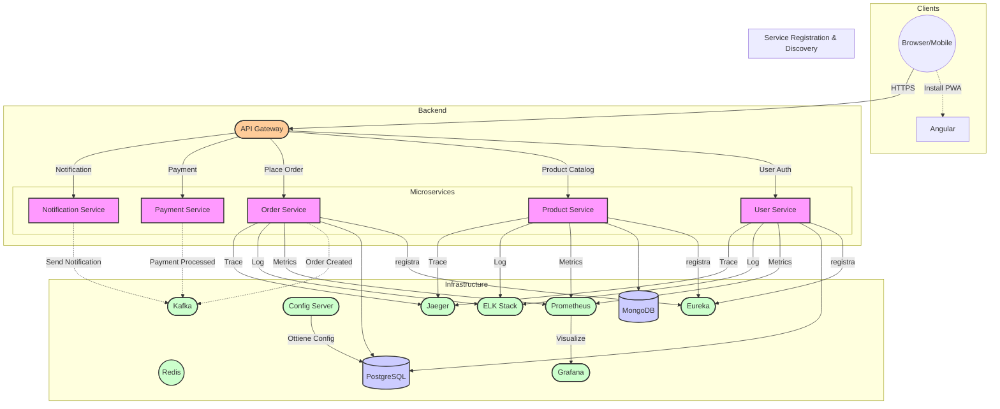

# E-commerce Microservices Architecture - Requisiti Generali

## **Introduzione**
Applicazione e-commerce basata su microservizi, sviluppata con Angular (frontend) e Spring Boot/Spring Cloud (backend).  
**Obiettivi principali**: Scalabilità, resilienza, sicurezza e osservabilità.

---

## **Architettura**

---

## **Componenti Principali**
1. **Frontend**: SPA Angular con funzionalità PWA
2. **API Gateway**: Punto di ingresso unico per tutte le richieste
3. **Microservizi Business**: User, Product, Order, Payment, Notification
4. **Infrastruttura**: Service Discovery, Config Server, Kafka, Redis
5. **Database**: PostgreSQL (transazioni ACID) + MongoDB (flessibilità schema)

---

## **Funzionalità Principali**
- Registrazione/Login utente con JWT e 2FA (opzionale)
- Catalogo prodotti con ricerca/filtri avanzati
- Carrello e checkout con gestione transazioni distribuite (Saga Pattern)
- Pagamenti integrati (Stripe/PayPal simulati)
- Notifiche in tempo reale (email/push)
- Dashboard admin per gestione utenti/ordini

---

## **Stack Tecnologico**

### **Frontend**
| Tecnologia          | Descrizione                                  |
|---------------------|----------------------------------------------|
| Angular             | Framework per SPA (TypeScript)               |
| SCSS                | Preprocessore CSS con variabili/nesting      |
| Bootstrap + Angular Material | UI Components & Responsive Layout    |
| RxJS                | Gestione stati reattivi/asincroni            |
| PWA                 | Offline mode, installabilità                 |
| Cypress             | Test end-to-end automatizzati                |
| i18n                | Supporto multilingua                         |

### **Backend (Microservizi)**
| Tecnologia          | Descrizione                                  |
|---------------------|----------------------------------------------|
| Java 17             | Linguaggio principale                       |
| Spring Boot         | Creazione microservizi                      |
| Spring Cloud Gateway| API Gateway (routing, rate limiting)        |
| Resilience4j        | Circuit Breaker, Retry, Bulkhead Pattern    |
| Spring Security + JWT | Autenticazione/autorizzazione             |
| Spring Data JPA + Hibernate | ORM per PostgreSQL                |
| Spring Kafka        | Messaggistica asincrona                     |
| Redis               | Cache distribuita                           |
| Spring Batch        | Elaborazioni batch                          |

### **Infrastruttura**
| Tecnologia          | Descrizione                                 |
|---------------------|---------------------------------------------|
| Eureka              | Service Discovery                           |
| Spring Cloud Config | Configurazione centralizzata                |
| Kafka               | Message broker per eventi                   |
| Docker + Kubernetes | Containerizzazione & Orchestrazione         |
| GitLab CI           | Pipeline CI/CD                              |
| Prometheus + Grafana | Monitoraggio metriche                      |
| ELK Stack           | Gestione log centralizzata                  |
| Jaeger              | Tracciamento distribuito                    |

### **Database**
| Tecnologia          | Descrizione                                 |
|---------------------|---------------------------------------------|
| PostgreSQL          | Dati strutturati (utenti, ordini)           |
| MongoDB             | Dati semi-strutturati (recensioni, sessioni)|

---

## **Dettagli di Implementazione e Best Practice**

### **Transazioni Distribuite (Saga Pattern)**

*   **Implementazione:** Choreography-based Saga. I microservizi comunicano in modo asincrono tramite eventi pubblicati su Kafka. Questo approccio decentralizzato aumenta la scalabilità e riduce l'accoppiamento.

*   **Flusso di Esempio (Creazione Ordine):**

    1.  **Order Service:** Riceve una richiesta di creazione ordine. Inizia una transazione locale e crea un record "ordine" con stato "PENDING".
    2.  **Order Service:** Pubblica un evento `OrderCreated` su Kafka.
    3.  **Product Service:** Ascolta l'evento `OrderCreated`. Verifica la disponibilità dei prodotti e, se disponibili, aggiorna la quantità (transazione locale). Pubblica un evento `ProductReserved` (o `ProductOutOfStock` se non disponibili).
    4.  **Payment Service:** Ascolta l'evento `ProductReserved`. Tenta di elaborare il pagamento (simulazione di integrazione con Stripe/PayPal). Pubblica un evento `PaymentProcessed` (o `PaymentFailed`).
    5.  **Order Service:** Ascolta gli eventi `ProductReserved` e `PaymentProcessed`. Se entrambi hanno successo, aggiorna lo stato dell'ordine a "CONFIRMED" (transazione locale). Se uno dei due fallisce, inizia il processo di compensazione.

*   **Azioni di Compensazione:**

    *   Se `ProductOutOfStock` o `PaymentFailed` -> **Order Service:** aggiorna lo stato dell'ordine a "CANCELED". Pubblica un evento `OrderCanceled`.
    *   Se `ProductReserved` -> **Product Service:** in caso di `OrderCanceled` ascolta e incrementa di nuovo la disponibilità (rollback).
    *   Se `PaymentProcessed` -> **Payment Service:** in caso di `OrderCanceled` esegue un rimborso (simulato). Pubblica un evento `PaymentRefunded`.
    *   **Notification Service:** invia email/notifiche agli utenti in base agli eventi (es. `OrderCanceled`, `OrderConfirmed`, `PaymentFailed`, ecc.).

*   **Idempotenza:** Ogni microservizio deve gestire messaggi duplicati (Kafka *at-least-once delivery*). Implementare l'idempotenza (es., usando un ID univoco per l'ordine/transazione e controllando se un messaggio con quell'ID è già stato processato).

### **Resilienza (Resilience4j)**

*   **Circuit Breaker:**
    *   Applicato tra l'API Gateway e i microservizi: se un microservizio non risponde o restituisce errori ripetutamente, il circuit breaker si apre, impedendo ulteriori chiamate e restituendo una risposta di fallback (es., un messaggio di errore o dati predefiniti).
    *   Applicato tra microservizi interdipendenti: es. tra Order Service e Payment Service, per evitare *cascading failures*.
    *   **Configurazione:** Definire soglie di errore (es., 5 errori consecutivi), durata dello stato "aperto" (es., 60 secondi) e durata dello stato "mezzo aperto" (es., 30 secondi) nel file di configurazione (tramite Spring Cloud Config).

*   **Retry:**
    *   Applicato a chiamate API potenzialmente transitorie (es., brevi interruzioni di rete).
    *   **Configurazione:** Definire il numero massimo di tentativi (es., 3), l'intervallo tra tentativi (backoff esponenziale: 1s, 2s, 4s) e le eccezioni su cui ritentare (es., `java.net.ConnectException`, `java.net.SocketTimeoutException`, errori HTTP 5xx, *ma non* errori HTTP 4xx).

*   **Bulkhead:**
    *   Applicato al Payment Service (per evitare di saturare il servizio simulato di pagamento, che potrebbe avere risorse limitate).
    *   **Configurazione:** Limitare il numero massimo di chiamate concorrenti (es., 10).

*   **Rate Limiter:**
    *   Implementato a livello di API Gateway (Spring Cloud Gateway).
    *   **Configurazione:** Definire il numero massimo di richieste per unità di tempo (es., 100 richieste al secondo per utente, 1000 richieste al secondo globali). Le richieste in eccesso vengono rifiutate con un codice di errore HTTP 429 (Too Many Requests) e un header `Retry-After` appropriato.

### **Gestione della Configurazione**

*   **Spring Cloud Config:** I file di configurazione (YAML) sono gestiti in un repository Git (privato).
*   **Vault (HashiCorp Vault):**
    *   I *segreti* (password, chiavi API) *non* sono memorizzati nel repository Git (per ovvi motivi di sicurezza).
    *   Sono memorizzati in modo sicuro in Vault.
    *   Spring Cloud Config è integrato con Vault (tramite `spring-cloud-starter-vault-config`). I microservizi ottengono i segreti da Vault all'avvio, in modo trasparente.
*   **Refresh Scope:**
    *   Le configurazioni caricate da Spring Cloud Config possono essere aggiornate *dinamicamente* (senza riavviare i microservizi) usando l'annotation `@RefreshScope` sulle classi che usano le proprietà configurate e invocando l'endpoint `/actuator/refresh` (questo endpoint *deve* essere protetto tramite autenticazione!).

### **Sicurezza**

*   **HTTPS:** Tutti i servizi (inclusi API Gateway e frontend) comunicano tramite HTTPS. Certificati SSL/TLS gestiti (eventualmente) tramite Kubernetes (cert-manager) o dal provider cloud.

*   **Autenticazione:**

    *   **JWT (JSON Web Token):**
        *   Il User Service gestisce l'autenticazione (username/password, 2FA).
        *   Dopo un'autenticazione riuscita, il User Service emette un JWT firmato.
        *   Il JWT contiene le informazioni sull'utente (ID, ruoli), una *issuer* (chi ha emesso il token), una *audience* (per chi è destinato il token) e una scadenza.
        *   Il frontend include il JWT nell'header `Authorization` (Bearer token) di ogni richiesta.
        *   L'API Gateway (con Spring Security) intercetta e decodifica il JWT.
        *   L'API Gateway e i microservizi *validano* la firma del JWT e la sua scadenza (usando una chiave pubblica/privata o una chiave segreta condivisa, *non* contattando il User Service per *ogni* richiesta!).

    *   **OAuth2 (Authorization Code Grant con PKCE):**
        *   Viene utilizzato il flusso "Authorization Code Grant with PKCE (Proof Key for Code Exchange)" per l'autenticazione degli utenti. PKCE aggiunge un ulteriore livello di sicurezza, particolarmente importante per le applicazioni client-side (come la nostra PWA).
            1.  Il client (frontend) genera un *code verifier* (una stringa casuale) e un *code challenge* (un hash del code verifier).
            2.  Il client reindirizza l'utente al server di autorizzazione (User Service), includendo il code challenge e il metodo di trasformazione (es., SHA256).
            3.  L'utente si autentica (e fornisce il consenso, se necessario).
            4.  Il server di autorizzazione reindirizza l'utente al client con un *codice di autorizzazione*.
            5.  Il client scambia il codice di autorizzazione con un *access token* (JWT) e un *refresh token* (chiamata backend-to-backend), includendo il code verifier.
            6.  Il server di autorizzazione verifica che il code verifier corrisponda al code challenge precedentemente inviato.
            7.  Il client usa l'access token per accedere alle risorse protette.
            8.  Quando l'access token scade, il client usa il refresh token per ottenere un nuovo access token (senza richiedere nuovamente le credenziali all'utente).

        *   **Gestione Refresh Token Sicura:**
            *   I refresh token hanno una durata più lunga degli access token.
            *   *Non* devono essere memorizzati nel LocalStorage del browser (troppo vulnerabile).
            *   Opzioni di memorizzazione sicura:
                *   **Cookie HttpOnly:** Il refresh token è memorizzato in un cookie con l'attributo `HttpOnly` (inaccessibile da JavaScript) e `Secure` (inviato solo su HTTPS).  Richiede una gestione attenta delle policy CORS.
                *   **Backend-for-Frontend (BFF):** Un componente backend (es., una funzione all'interno dell'API Gateway) gestisce il refresh token per conto del frontend.  Il frontend riceve solo l'access token.  Aumenta la complessità, ma offre maggiore sicurezza.
            *  **Rotazione dei Refresh Token**: Ad ogni utilizzo, viene rilasciato assieme ad un nuovo access token, anche un nuovo refresh token

    *   **2FA (Two-Factor Authentication - opzionale):**
        *   Implementato usando TOTP (Time-Based One-Time Password).
        *   Il User Service genera un segreto condiviso (visualizzato come QR code tramite una libreria come `java-google-authenticator`).
        *   L'utente scansiona il QR code con un'app di autenticazione (Google Authenticator, Authy, ecc.).
        *   Durante il login, l'utente fornisce il codice TOTP generato dall'app, che viene validato dal User Service (controllando che il codice sia valido per il segreto condiviso e per il timestamp corrente, con una tolleranza per la deriva dell'orologio).

*   **WAF (Web Application Firewall):**
    *   Integrato nell'API Gateway (tramite configurazione di Spring Cloud Gateway + Spring Security).
    *   Fornisce protezione di base contro attacchi comuni (XSS, SQL Injection, CSRF, ecc.). Per una protezione più avanzata (es., protezione da DDoS, bot mitigation, ecc.), utilizzare un WAF dedicato (es., AWS WAF, Cloudflare WAF).
    * **Spring Security (protezione a livello di applicazione):**
        *  **Prevenzione XSS (Cross-Site Scripting):** Spring Security, per impostazione predefinita, effettua l'escaping dell'output HTML, proteggendo da attacchi XSS.
        *   **Protezione CSRF (Cross-Site Request Forgery):** Abilitare la protezione CSRF di Spring Security (abilitata per default, ma è *importante* configurarla correttamente, specialmente in un'architettura a microservizi).  Il frontend deve includere il token CSRF in ogni richiesta non-GET.
        *  **Prevenzione SQL Injection**: Usare *sempre* prepared statements e *mai* concatenazione di stringhe per costruire query SQL. Spring Data JPA lo fa *automaticamente* se usi i metodi forniti dai repository.  Se scrivi query JPQL o SQL native, usa *sempre* i parametri (`:` nel JPQL, `?` nel SQL nativo) e *mai* la concatenazione.

* **Autorizzazioni (RBAC - Role-Based Access Control):**
    * Implementato tramite ruoli definiti nel JWT (e.g., `ROLE_USER`, `ROLE_ADMIN`).
    * Utilizzo delle annotazioni `@PreAuthorize` di Spring Security sui metodi dei controller per controllare l'accesso in base al ruolo. Esempio:

      ```java
      @PreAuthorize("hasRole('ROLE_ADMIN')")
        public ResponseEntity<?> deleteProduct(@PathVariable Long productId) {
           // ...
       }
         ```
    *   Oltre a `@PreAuthorize`, considera l'utilizzo di *voters* personalizzati (classi che implementano `AccessDecisionVoter`) per logiche di autorizzazione più complesse (es., "un utente può modificare un ordine solo se è il *proprietario* dell'ordine").

### **Caching (Redis)**

*   **Dati Cacheati:** Catalogo prodotti (liste, dettagli dei singoli prodotti, ma *non* la disponibilità, che deve essere sempre aggiornata). Dati utente *non sensibili* e frequentemente letti (es., nome utente, preferenze di visualizzazione).

*   **Strategie di Caching:**

    *   **Cache-Aside:** L'applicazione verifica prima se i dati sono in cache. Se sì, li restituisce. Altrimenti, li recupera dal database, li inserisce in cache e poi li restituisce.
        ```java
        @Cacheable(value = "products", key = "#id", unless = "#result == null") //cache solo se diverso da null
    public Product getProductById(Long id) {
    // ... logica per recuperare il prodotto dal database
    }

         @CachePut(value = "products", key = "#product.id")
        public Product updateProduct(Product product) {
             // ... logica per aggiornare
              return product;
        }

         @CacheEvict(value = "products", key = "#id") // Invalida cache per id
          public void deleteProduct(Long id) {
           // ...logica
    }

    //Invalida l'intera cache
    @CacheEvict(value = "products", allEntries = true)
    public void clearProductCache(){
    }
    ```

    *   **Scadenza (TTL):** TTL brevi per dati che cambiano più frequentemente (es., 5-10 minuti per il catalogo prodotti). TTL più lunghi per dati che cambiano meno frequentemente (es., 1-2 ore per i dati del profilo utente).  *Non* usare una cache per la *disponibilità* dei prodotti, a meno che tu non abbia un meccanismo di invalidamento *immediato* (es., tramite eventi).

*   **Invalidazione della Cache:**
    *   Scadenza automatica (TTL).
    *   `@CacheEvict`: Annotazione per invalidare esplicitamente la cache quando i dati vengono modificati (es., dopo un aggiornamento o una cancellazione).
    *   *Invalidazione proattiva (opzionale, più complesso):*  I microservizi possono pubblicare eventi su Kafka quando i dati cambiano. Un componente dedicato (o il microservizio stesso) ascolta questi eventi e invalida la cache in modo mirato. Questo approccio è più efficiente dell'invalidazione basata sul TTL, ma richiede una maggiore complessità.

*   **Dimensione della Cache:** Configurare Redis per utilizzare una quantità di memoria *ragionevole* (in base alla RAM disponibile) e per usare una policy di eviction appropriata (es., LRU - Least Recently Used, o LFU - Least Frequently Used) quando la cache è piena.

### **Test**

*   **Unit Test (JUnit 5, Mockito):** Test isolati per singole classi e metodi (es., testare la logica di un service senza coinvolgere il database o altri componenti esterni). Usare Mockito per simulare le dipendenze.
*   **Integration Test (Spring Boot Test):** Test che verificano l'interazione tra più componenti *all'interno di un singolo microservizio* (es., controller + service + repository).
    *   Utilizzare `@SpringBootTest` per avviare un contesto Spring Boot ridotto.
    *    Utilizzare un database in-memory (H2) o Testcontainers (per testare con un database *reale* in un container Docker) per isolare i test. *Evitare* di usare il database di produzione nei test di integrazione!
    *  Usare `@AutoConfigureMockMvc` per testare i controller Spring MVC/WebFlux.

*   **Contract Test (Spring Cloud Contract):** Test che verificano che i *contratti* API (formato delle richieste/risposte, header, codici di stato) tra i microservizi siano rispettati. Aiutano a prevenire problemi di integrazione quando i microservizi vengono aggiornati in modo indipendente.
    *   Definire i contratti in file Groovy o YAML.
    *   Spring Cloud Contract genera automaticamente i test (lato *consumer*) e gli stub (lato *provider*).

*   **End-to-End Test (E2E - Cypress):** Test che simulano l'interazione completa di un utente con l'applicazione, dal frontend al backend.
    *   Utilizzare Cypress per automatizzare le interazioni con il browser (click, input, navigazione).
    *   Testare i flussi utente principali (es., registrazione, login, aggiunta al carrello, checkout).
    * *Non* abusare dei test E2E: sono più lenti e fragili dei test unitari e di integrazione. Usali per testare i flussi *critici*.

### **API Gateway (Spring Cloud Gateway)**

*   **Routing:** Configurazione delle route per instradare le richieste ai microservizi appropriati (in base al percorso dell'URL, agli header, ecc.).  Esempio:

    ```yaml
    spring:
      cloud:
        gateway:
          routes:
            - id: user_service
              uri: lb://user-service  # lb = load balancing (tramite Eureka)
              predicates:
                - Path=/api/users/**
            - id: product_service
              uri: lb://product-service
              predicates:
                - Path=/api/products/**

    ```

*   **Rate Limiting:** (vedi sezione Resilienza).
*   **Autenticazione (di base):** Validazione del JWT (vedi sezione Sicurezza). Il gateway *non* gestisce la *creazione* del JWT, ma *solo* la sua validazione. Configurare Spring Security sul gateway per validare il token JWT (firma, scadenza, issuer, audience).
    *   Il gateway *non* deve contenere logica di business complessa. Deve rimanere *leggero* e *focalizzato* sul routing, la sicurezza di base e la resilienza.
    *   Utilizzare i *filtri* di Spring Cloud Gateway per aggiungere funzionalità (es., aggiungere header, trasformare le richieste/risposte, ecc.).

### **Internazionalizzazione (i18n)**

*   Supporto per i locali `en-US` (Inglese - Stati Uniti) e `it-IT` (Italiano - Italia).  Aggiungere altri locali in base alle esigenze.
*   Utilizzo di file di risorse (properties o YAML) per memorizzare i messaggi in diverse lingue (es., `messages_en.properties`, `messages_it.properties`).
*   In Angular, utilizzo del modulo `@angular/localize`.
*   In Spring Boot, utilizzo di `MessageSource` e `LocaleResolver`.
    *   **`Accept-Language` Header:** Il browser invia l'header `Accept-Language` con la lingua preferita dall'utente.  Spring Boot (tramite `LocaleResolver`) utilizza questo header per determinare la lingua da usare (con fallback a una lingua di default se la lingua richiesta non è supportata).
    *   **Parametro URL (opzionale):** È possibile aggiungere un parametro all'URL per specificare la lingua (es., `/products?lang=it`). Questo approccio è utile per scopi di testing o per consentire all'utente di cambiare lingua esplicitamente.

### **Comunicazioni Asincrone/Sincrone**

* Le chiamate dal Frontend al Backend avvengono in maniera asincrona (tramite le API REST del backend)
*   Tra Backend e database, le chiamate sono tipicamente *sincrone* (JPA, MongoRepository), a meno che non si utilizzino API *reattive* (es. Spring Data R2DBC per database relazionali, o il driver reattivo di MongoDB). Per semplicità, in questo esempio, assumiamo comunicazioni sincrone con i database.

*   **Sincrone (REST - richieste/risposte immediate):**

    *   Autenticazione utente (login, ottenimento JWT).
    *   Recupero catalogo prodotti (lettura).
    *   Aggiornamento profilo utente.
    * Operazioni CRUD che *non* richiedono transazioni distribuite.

*   **Asincrone (eventi su Kafka):**

    *   Creazione ordine (dopo la creazione iniziale - che può essere sincrona per restituire l'ID dell'ordine - il resto del flusso è asincrono).
    *   Elaborazione pagamento.
    *   Invio notifiche (email/push).
    * Qualsiasi operazione che coinvolga più microservizi e che *non* richieda una risposta immediata al client.

---

## Auditing
* **Obiettivo:** Registrare eventi significativi per la sicurezza, la conformità e la risoluzione dei problemi.
* Implementazione (Multi-livello):
  1. Livello Applicazione (Spring Data Auditing): (come descritto precedentemente).
  2. Livello Applicazione (Custom AuditLogService): (come descritto precedentemente).
  3. Livello Database (pgAudit - opzionale, ma consigliato per PostgreSQL): (come descritto precedentemente)
  4. Livello API Gateway: (come descritto precedentemente).
  5. Livello Security (Spring Security): (come descritto precedentemente).

--- 

## **Protocolli**

*   HTTP/2 per ottimizzazione delle performance (supportato da Spring Cloud Gateway e dai moderni browser).
*   gRPC (opzionale): Potrebbe essere utilizzato per comunicazioni *interne* tra microservizi ad alte prestazioni (es., tra Order Service e Product Service per la verifica della disponibilità), *ma non* esposto direttamente al frontend.  Richiede la definizione di interfacce `.proto` e la generazione di codice.  Aggiunge complessità, quindi valutare attentamente se i benefici in termini di performance giustificano il costo.

---

## **Roadmap di Sviluppo (con stime temporali - indicative!)**

1.  **Infrastruttura Base (1-2 settimane):** Eureka, Config Server, API Gateway (configurazione di base, routing, rate limiting di base), Kafka (installazione e configurazione di base).
2.  **User Service (2-3 settimane):** Registrazione, autenticazione (JWT, OAuth2 con PKCE, 2FA opzionale), gestione profili, gestione ruoli (RBAC), test unitari/integrazione.
3.  **Product Service (2-3 settimane):** Catalogo prodotti, ricerca, filtri, gestione immagini, test unitari/integrazione, integrazione con Redis (caching).
4.  **Order Service (3-4 settimane):** Carrello, checkout, implementazione del Saga Pattern (coreografia con Kafka), gestione degli eventi, azioni di compensazione, test unitari/integrazione, test di contratto.
5.  **Payment Service (2-3 settimane):** Simulazione integrazione con un gateway di pagamento (Stripe/PayPal), gestione rimborsi (tramite eventi), test unitari/integrazione, test di contratto.
6.  **Notification Service (1-2 settimane):** Integrazione con Kafka, invio email (simulato usando un servizio come Mailtrap o SendGrid, *non* implementare un server SMTP!), gestione template email, test unitari/integrazione.
7.  **Frontend Angular (4-6 settimane):** Integrazione con API (tramite API Gateway), implementazione PWA (service worker, manifest, gestione offline, notifiche push opzionali), componenti UI (Angular Material, Bootstrap), gestione dello stato (RxJS), test E2E (Cypress), internazionalizzazione (i18n).
8.  **DevOps (2-4 settimane):** Dockerizzazione dei microservizi, configurazione Kubernetes (deployment, service, ingress, ConfigMap, Secret), configurazione CI/CD (GitLab CI), configurazione monitoraggio (Prometheus, Grafana), configurazione logging (ELK Stack), configurazione tracing (Jaeger), configurazione di un sistema di alerting (es., Prometheus Alertmanager).

**Note:**

*   Le stime temporali sono *indicative* e possono variare significativamente in base alla complessità specifica del progetto, all'esperienza del team e ad altri fattori.
*   Lo sviluppo dovrebbe procedere in modo iterativo e incrementale (seguendo metodologie Agile, es. Scrum). Rilasciare frequentemente e raccogliere feedback dagli stakeholder.
*  Dare priorità alla qualità del codice (seguendo i principi SOLID, DRY, KISS), alla scrittura di test e alla documentazione.

---

## **Installazione**

```bash
# Avvio infrastruttura con Docker Compose (servizi di base - per sviluppo locale)
docker-compose up -d eureka config-server kafka redis

# Per un ambiente completo (Kubernetes), seguire le istruzioni nel README.md dei singoli microservizi.
# Ogni microservizio avrà il suo Dockerfile e i suoi file di deployment Kubernetes.
# Il frontend Angular avrà il suo Dockerfile (es., basato su un'immagine Nginx) e i suoi file di deployment Kubernetes.
